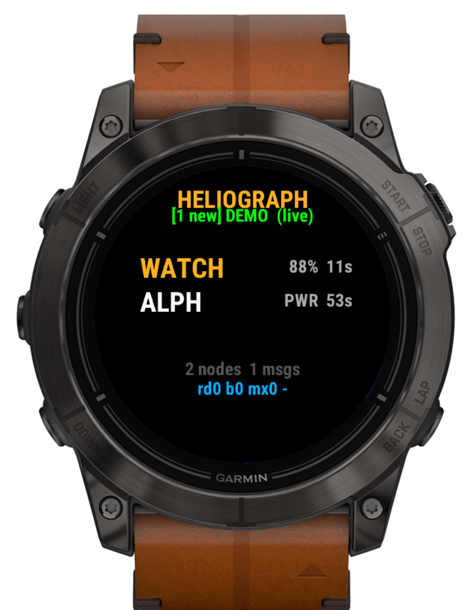
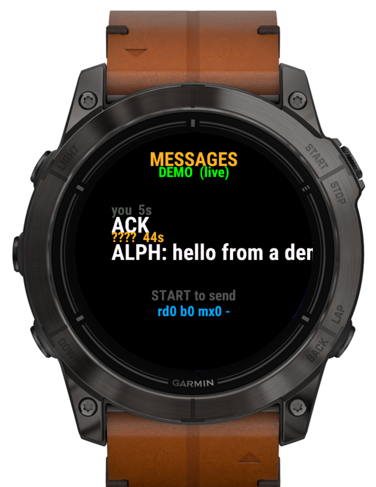
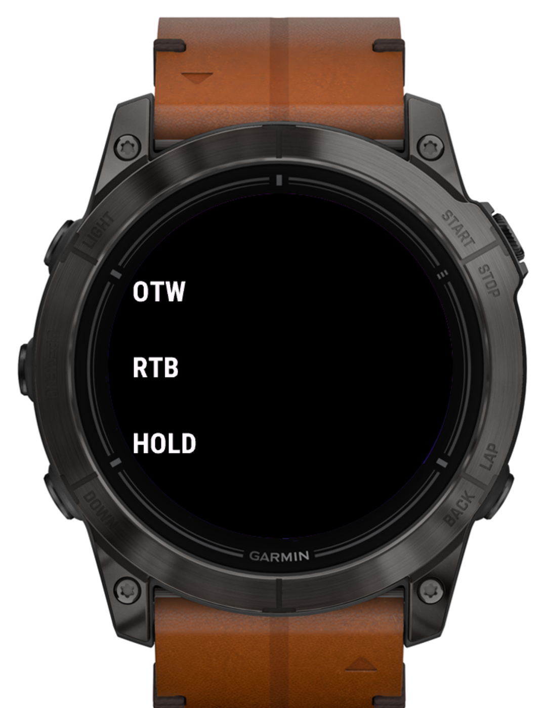

# meshwatch

A Meshtastic client for Garmin watches. Phone-free, internet-free — the watch
talks to a radio over BLE and shows you the mesh on your wrist.

> **Status: working prototype, not yet a usable Meshtastic client.**
> The watch UI, the BLE stack, the protobuf decoder, and the 10-device build
> are all real and tested. What is missing is a bridge that puts actual
> Meshtastic traffic in front of it — see [Where this actually
> stands](#where-this-actually-stands). Read that before installing.

## Screenshots

| Nodes view | Messages view | Canned-message picker |
| :---: | :---: | :---: |
|  |  |  |

Screens are Connect IQ simulator renders against `epix2pro51mm` (tactix 7
AMOLED), driven by the built-in demo roster.

## Where this actually stands

Being straight about this, because the gap is not obvious and you will
otherwise waste an evening on it.

**Connect IQ caps every BLE characteristic read and write at about 20 bytes,
and offers no way to raise it.** There is no MTU negotiation, no long read,
no blob read — the SDK contains no such symbol anywhere. That is a Garmin
platform limit, not a bug in this app.

Meshtastic's BLE API hands you one whole protobuf per `fromRadio` read. A text
`MeshPacket` spends roughly 17 bytes on framing — `FromRadio` header,
`MeshPacket` header, `from`, `to`, `channel` — before it reaches the payload,
and the next read dequeues the *next* packet, so the tail is gone for good. In
practice you recover node **numbers** and nothing else: no names, no message
text.

That leaves the two code paths here in very different shape:

| Path | Talks to | State |
| --- | --- | --- |
| `source/MeshClient.mc` | a stock Meshtastic node, directly over BLE | Connects, bonds, completes config sync. Then the 20-byte wall truncates every packet. Node numbers parse; names and messages do not. |
| `source/GatewayClient.mc` | a companion bridge speaking 20-byte frames | **Active path.** Transport proven on hardware: full names, multi-chunk message reassembly, send-and-echo all render correctly. But no public firmware speaks it. |

The bridge firmware this app was developed against served a **canned roster**
over a private LoRa protocol. It never spoke Meshtastic. It is not in this
repo, and it would not help you if it were.

**Net: you cannot currently pair this to a Meshtastic node and get a working
client.** The missing piece is a bridge — see [Roadmap](#roadmap).

## What it does today

- Renders a node roster: short name, battery, last-heard age, SNR, hop count
- Renders a message log; sends canned messages (`ACK` `RGR` `OTW` `RTB`
  `HOLD` `SOS`) or freeform text via the on-screen keyboard
- Scans, bonds, and completes a Meshtastic config sync over BLE
- Hand-rolled Meshtastic protobuf decoding in `source/Proto.mc`, with no
  runtime protobuf library
- Runs on ten Garmin devices from one source tree
- Ships a demo roster on first launch, so the UI is explorable with no radio

## What it does not do

- No mesh routing — the watch is a leaf; routing lives on the radio
- No phone, no Garmin Connect sync, no internet
- No on-watch node configuration — configure in the Meshtastic app or CLI
- **No photo or image transfer.** Meshtastic has no image transport: there is
  no image port in `PortNum`, and the maintainers have said file transfer will
  not be supported over sub-GHz LoRa. An earlier build carried a
  detection-thumbnail feature; it belonged to a different project and has been
  removed rather than left in to imply a protocol feature that does not exist.

## Supported watches

Any round Garmin watch on Connect IQ 3.0+ with BLE. Note there is no `tactix`
product id in Connect IQ — the whole tactix line ships under its fenix / epix
sibling.

| Device id | Display | Notes |
| --- | --- | --- |
| `fenix6xpro` | 280x280 MIP | tactix Delta class |
| `fenix7x` | 260x260 MIP | tactix 7 (non-AMOLED) |
| `fenix7xpro` | 260x260 MIP | |
| `fenix7xpronowifi` | 260x260 MIP | |
| `epix2pro51mm` | 416x416 AMOLED | tactix 7 AMOLED — primary dev target |
| `fenix847mm` | 454x454 AMOLED | tactix 8 / fenix 8 Pro 47 |
| `fenix8solar51mm` | 416x416 AMOLED | fenix 8 Solar 51 |
| `descentmk351mm` | 416x416 AMOLED | Descent Mk3 51 |
| `marq2` | 416x416 AMOLED | MARQ Gen 2 |
| `marq2aviator` | 416x416 AMOLED | MARQ Gen 2 Aviator |

`source/Layout.mc` picks row pitch and accent colour at runtime from the
display dimensions — AMOLED gets 52 px rows and amber; 64-colour MIP gets
44 px rows and an orange that will not dither to mud.

Only `epix2pro51mm` has been visually verified. The rest build clean, but the
MIP layout has not been eyeballed on hardware.

## Install

Signed `.prg` files for all ten watches are committed under `bin/`. Copy the
one matching your watch to `GARMIN/Apps/` over USB, then eject.

To build instead:

```bash
monkeyc -d epix2pro51mm -f monkey.jungle \
        -o bin/meshwatch-epix2pro51mm.prg \
        -y ~/.Garmin/developer_key.der
```

Requires the Connect IQ SDK (Windows or macOS only) and a developer key.

## Project layout

```
manifest.xml              app id, 10 products, BLE permission
monkey.jungle             build config
source/HeliographApp.mc   AppBase entry point
source/MainView.mc        nodes / messages pages
source/MainDelegate.mc    button map, send menu
source/MeshClient.mc      Meshtastic-direct BLE (blocked by the 20-byte wall)
source/GatewayClient.mc   20-byte bridge protocol (active path)
source/NodeStore.mc       node DB, Storage-backed
source/Proto.mc           hand-rolled Meshtastic protobuf decode
source/Layout.mc          per-device layout constants
tools/witness.py          PC-side witness: connects to a Meshtastic node over
                          USB serial and logs every text and node the watch
                          would see. Proves the mesh side independently.
```

## Roadmap

The one thing that matters is a bridge that puts real Meshtastic traffic in
front of the watch in 20-byte frames. Two shapes, best first:

1. **A Meshtastic firmware module.** One device runs Meshtastic *and* serves a
   CIQ-friendly GATT service. No second board. Upstreamable.
2. **A standalone ESP32 bridge.** Connects to a Meshtastic node over UART (the
   node speaks the same protobuf stream over serial, `0x94 0xc3` framed),
   re-frames into 20-byte chunks, serves them over BLE. Easier to ship, costs
   a second board.

Once a bridge exists, the client work worth doing, roughly in value order:

- Delivery ACKs (`ROUTING_APP`) — "did my message land?" is the biggest gap
- Position beaconing outbound, so the watch appears on everyone else's map
- Alerts (`ALERT_APP`) with wrist vibration
- Waypoints (`WAYPOINT_APP`)
- Channels — Meshtastic supports 8; this surfaces one
- Telemetry (`TELEMETRY_APP`), traceroute (`TRACEROUTE_APP`)

Worth raising upstream regardless: an MTU-safe read mode on Meshtastic's BLE
service would let stock nodes serve Garmin watches with no bridge at all.

## Troubleshooting

**Stuck on "scanning".** Expected without a bridge — see [Where this actually
stands](#where-this-actually-stands). Separately, a node already bonded to
your phone will not hand its GATT service to the watch.

**Paired but the roster is empty.** Config sync takes a few seconds. If the
status reads `live` and nothing arrives, the node has nothing to advertise yet.

**Layout looks wrong.** If your device id is not listed above, add it to
`manifest.xml` and rebuild; pixel offsets were tuned on the AMOLED matrix.

**`monkeyc` rejects the API level.** Pull your device profile through the
Connect IQ SDK Manager.

## Contributing

A bridge implementation is the single most valuable contribution. After that,
layout fixes for the MIP watches — offsets live in `source/Layout.mc` and
`source/MainView.mc`.

Issues welcome, with a watch model and Connect IQ version.

## License

MIT — see `LICENSE`.
